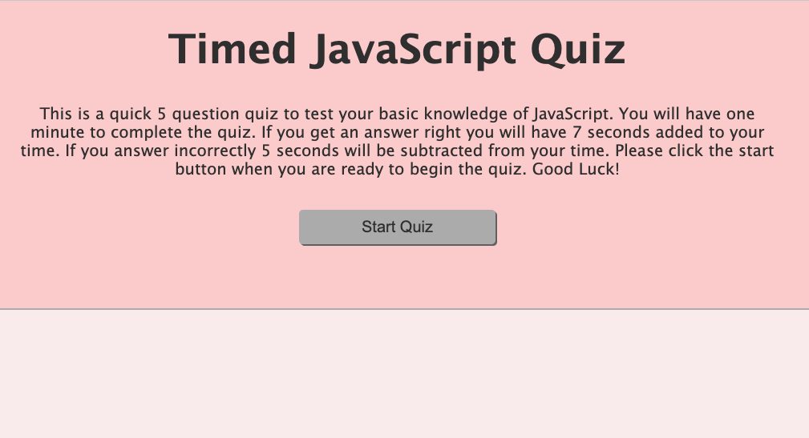
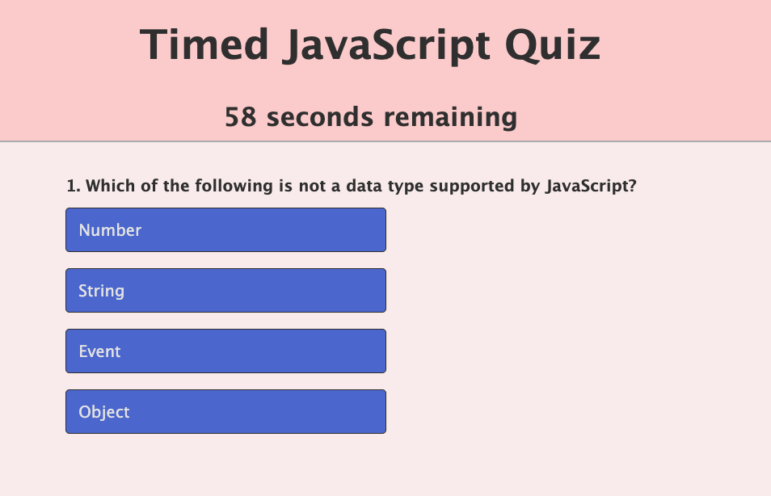

# Timed-Code-Quiz

## Description
* To generate a timed quiz that asks a few questions to test a potential web developer's knowledge of JavaScript and stores the high scores in order to compare with others who have taken the quiz.

[Timed Quiz Website](https://ckoehler16.github.io/Timed-Code-Quiz/)

## Requirements
* Landing page with a start button that when one clicks the "start" button the timer starts and the first multiple choice question appears.
* Once a question is answered the next question appears while the timer continues to count down.
* If a question is answered incorrectly then time is subtracted from the clock.
* If a question is answered correctly then time is added to the clock.
* The quiz is over when all the questions are answered or the timer has reached 0.
* When the quiz is over there is an opportunity to enter one's name and save their score.
* The high scores are stored and can be viewed. 

## Built With
* html
* css
* javascript

## Contribution
Made with blood, sweat, and tears by Courtney Koehler

### ©️2022 CourtneyKoehler
